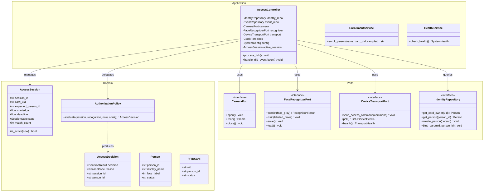

# Component Architecture (C4 Level 3)

**Document ID:** `DOC-02-COMPONENT`  
**Status:** Implementation Baseline  
**Version:** 1.0.0  
**Date:** September 29, 2026  

---

## 1. Host Application Component Model

The diagram below details the internal structure of the Python host application and its decomposition into domain, application, ports, and adapters.



---

## 2. Firmware Component Breakdown (ESP32)

The ESP32 firmware is divided into four modular subsystems coordinated by a deterministic main loop:

```text
firmware/
├── include/
│   ├── config.h            # Pin definitions, baud rates, timing constants
│   ├── protocol.h          # NDJSON message structs and ArduinoJson serializers
│   ├── rfid_subsystem.h    # MFRC522 SPI driver and debounce logic
│   ├── actuator_subsystem.h# SG90 PWM driver, LED togglers, Buzzer player
│   └── safety_watchdog.h   # Heartbeat emitter and link-loss fail-closed guard
└── src/
    └── main.cpp            # FreeRTOS / Arduino setup() and loop() orchestration
```

### Firmware Responsibilities

1. **`rfid_subsystem`:** Configures VSPI pins, polls `mfrc522.PICC_IsNewCardPresent()` and `mfrc522.PICC_ReadCardSerial()`, extracts hex UID string, and prevents rapid duplicate emissions via a $500\text{ ms}$ debounce lock.
2. **`actuator_subsystem`:** Binds ESP32 LEDC PWM channel to GPIO 25. Manages non-blocking state machine for door unlocking ($90^\circ$), holding ($3000\text{ ms}$), and relocking ($0^\circ$). Coordinates GPIO 26 (Green LED), GPIO 27 (Red LED), and GPIO 32 (Buzzer).
3. **`protocol`:** Deserializes incoming NDJSON lines from `Serial` into `AccessCommand` C++ structs using `ArduinoJson`. Serializes `RfidEvent`, `CommandResult`, and `Heartbeat` messages to `Serial`.
4. **`safety_watchdog`:** Emits periodic heartbeat every $1000\text{ ms}$. If the door is open and the hold timer expires, it forcibly closes the door even if no further host commands arrive.
