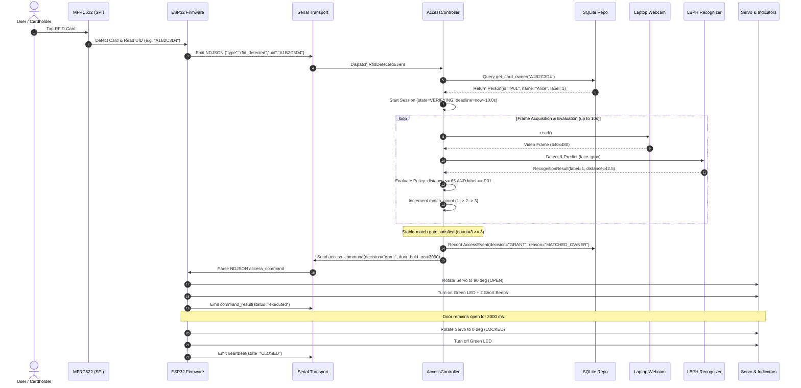
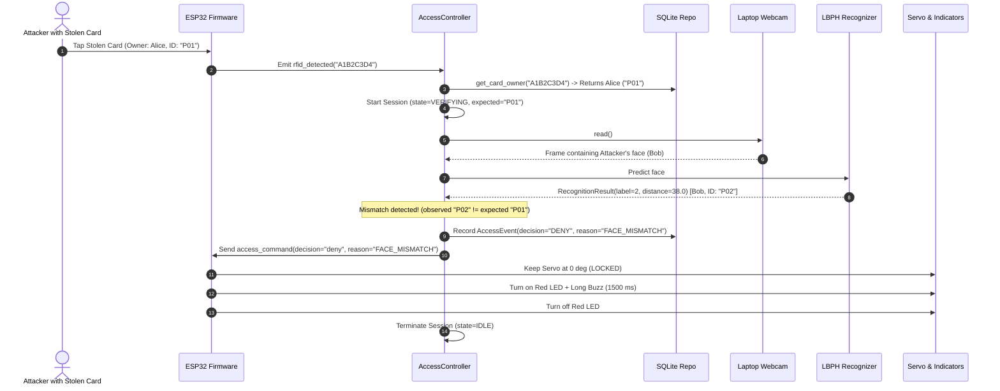
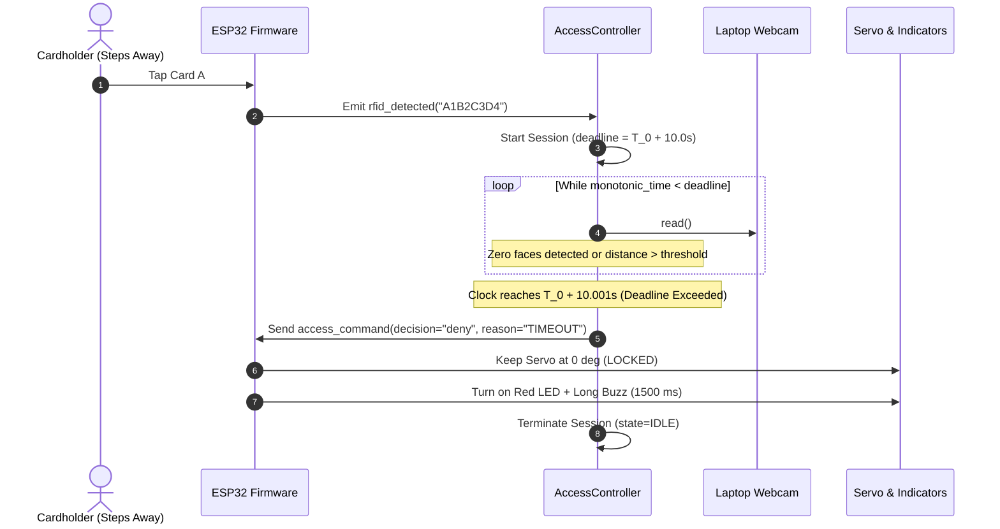

# End-to-End Data Flow & Sequence Models

**Document ID:** `DOC-02-FLOW`  
**Status:** Implementation Baseline  
**Version:** 1.0.0  
**Date:** September 29, 2026  

---

## 1. Sequence Diagram: Authorized Access Flow (Happy Path)

The sequence diagram below details the exact message choreography between the user, hardware, firmware, and host application during a successful authorization sequence.

---

## 2. Sequence Diagram: Biometric Mismatch Flow (Wrong Face)

---

## 3. Sequence Diagram: 10-Second Window Expiration Flow (Timeout)

