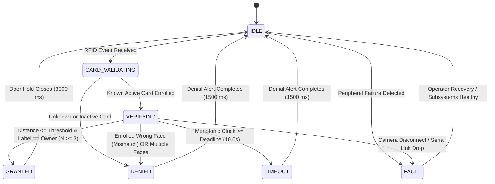
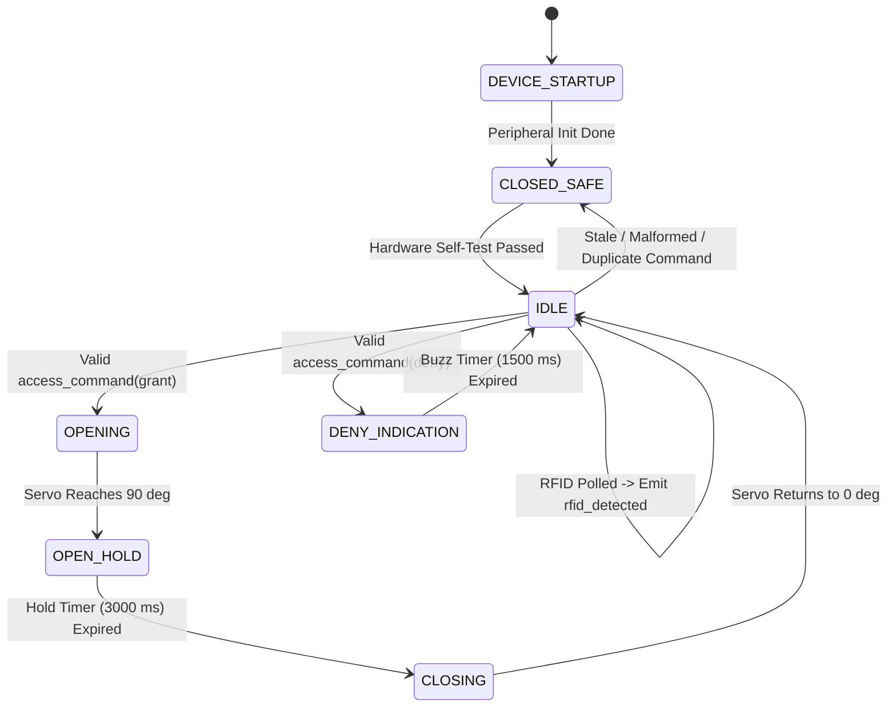

# Finite State Machine Specifications

**Document ID:** `DOC-02-STATE`  
**Status:** Implementation Baseline  
**Version:** 1.0.0  
**Date:** September 29, 2026  

---

## 1. Canonical Host State Machine

DualKey eliminates ambiguous boolean state flags by governing all access sessions through an authoritative Finite State Machine (FSM).

### Host State Definitions & Invariants

| State | Entry Condition | Allowed Host Actions | Invariants & Output Safety | Exit Condition |
| :--- | :--- | :--- | :--- | :--- |
| **`IDLE`** | Initial boot, or completion of prior session. | Listen for incoming serial events; monitor health. | Servo command MUST NOT be emitted. Indicators dark. | Receipt of `rfid_detected` event. |
| **`CARD_VALIDATING`**| `rfid_detected` message received. | Query SQLite `IdentityRepository` for card UID. | Camera is NOT engaged yet. Door remains locked. | Valid card $\to$ `VERIFYING`; Invalid $\to$ `DENIED`. |
| **`VERIFYING`** | Card is active and registered to person. Monotonic `deadline = now + 10.0s`. | Acquire camera frames; detect faces; execute LBPH prediction; evaluate policy. | No physical unlock command may be sent until stable match gate is satisfied. | Positive match $\to$ `GRANTED`; Mismatch $\to$ `DENIED`; Timeout $\to$ `TIMEOUT`; Error $\to$ `FAULT`. |
| **`GRANTED`** | Authorization formula evaluates to TRUE with $N \ge 3$ consistent matches. | Emit `access_command(decision="grant")`; log audit record; await command ack. | Door is physically commanded to open position for configured hold time. | Hold interval expires and door returns to locked state $\to$ `IDLE`. |
| **`DENIED`** | Unknown card, wrong enrolled face, or multiple faces detected. | Emit `access_command(decision="deny")`; log audit failure. | Servo remains strictly locked at $0^\circ$. Red LED and buzzer alert active. | Alert duration ($1500\text{ ms}$) completes $\to$ `IDLE`. |
| **`TIMEOUT`** | Monotonic clock exceeds `session.deadline` (10.0s) during `VERIFYING`. | Emit `access_command(decision="deny", reason="TIMEOUT")`; log audit record. | Servo remains strictly locked at $0^\circ$. Red LED and buzzer alert active. | Alert duration completes $\to$ `IDLE`. |
| **`FAULT`** | Camera missing, serial bus disconnected, or storage corruption. | Discard active sessions; force fail-closed; log diagnostic fault. | Actuator MUST remain locked. All access requests rejected. | System recovery and diagnostic health checks pass $\to$ `IDLE`. |

---

## 2. ESP32 Firmware State Machine

The microcontroller implements a complementary hardware state machine that enforces fail-closed physical execution.

### Firmware Transitions

1. **`DEVICE_STARTUP` $\to$ `CLOSED_SAFE`:** On hardware reset or power application, the LEDC PWM hardware immediately sets the pulse width to $0.5\text{ ms}$ ($0^\circ$). All LEDs are cleared.
2. **`IDLE` $\to$ `OPENING`:** Triggered strictly when an `access_command` is deserialized with `decision == "grant"`. The command ID is validated for freshness against the last executed ID.
3. **`OPEN_HOLD` $\to$ `CLOSING`:** Controlled by a non-blocking hardware timer (`millis() - open_start_ms >= hold_duration_ms`). The firmware does not rely on a host command to close the door, preventing stuck-open failures if the serial cable is severed while open.
4. **Stale/Corrupt Protection:** Any parse error or duplicate command immediately sends the device to `CLOSED_SAFE`, maintaining lock engagement.
