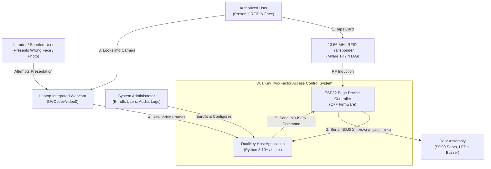

# System Context (C4 Level 1)

**Document ID:** `DOC-02-CONTEXT`  
**Status:** Implementation Baseline  
**Version:** 1.0.0  
**Date:** September 29, 2026  

---

## 1. System Context Diagram

The System Context diagram illustrates DualKey in relation to human actors and physical peripherals in its operational environment.

### Textual Equivalent

1. **Authorized User:** Holds an enrolled RFID card to the MFRC522 antenna and positions their face toward the laptop webcam within 10 seconds.
2. **Intruder / Attacker:** Attempts entry with an unknown RFID card, a stolen RFID card with an unmatched face, or presents a 2D photograph.
3. **Operator / Administrator:** Interacts with the host CLI to enroll identities, associate card UIDs, capture training images, inspect audit logs, and calibrate recognition thresholds.
4. **Laptop Webcam:** Delivers live video frames over USB (UVC) to the host OpenCV pipeline.
5. **DualKey Host:** Executes session management, biometric feature extraction, threshold comparison, and audit logging.
6. **ESP32 Edge Controller:** Collects RFID card events, drives the servo PWM line, toggles status LEDs, and sounds the buzzer upon receiving authoritative host commands.
7. **Door Hardware:** Physical mock-up containing the SG90 servo motor (latch), Green LED, Red LED, and audible buzzer.
