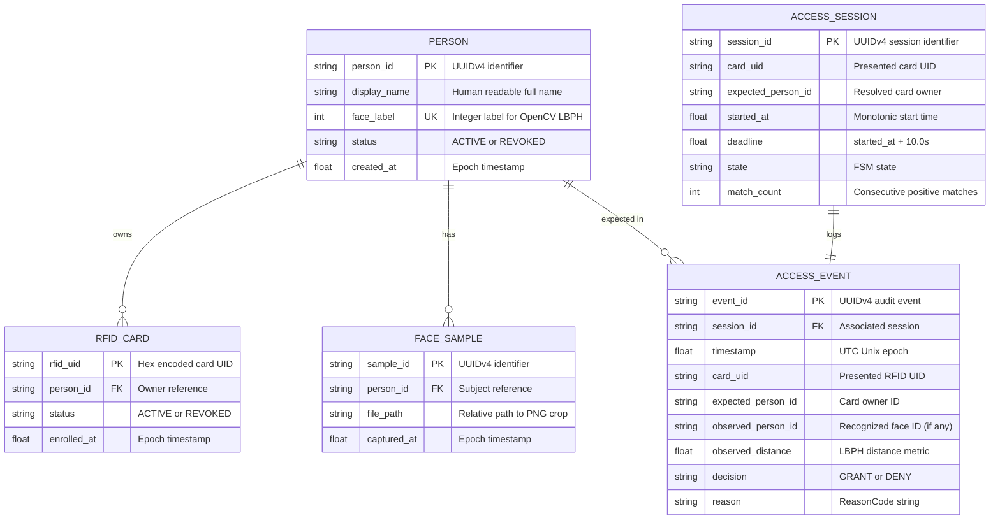

# Domain Identity & Data Models

**Document ID:** `DOC-03-MODEL`  
**Status:** Implementation Baseline  
**Version:** 1.0.0  
**Date:** September 29, 2026  

---

## 1. Domain Entities & Relationships

DualKey maintains an explicit, relational domain model. Entities represent core identity and session concepts without coupling to persistence or UI logic.



---

## 2. Python Data Model Implementations (`app/domain/models.py`)

```python
from dataclasses import dataclass, field
from enum import Enum
from typing import Optional
import time

class UserStatus(str, Enum):
    ACTIVE = "ACTIVE"
    REVOKED = "REVOKED"

@dataclass(frozen=True)
class Person:
    person_id: str
    display_name: str
    face_label: int
    status: UserStatus = UserStatus.ACTIVE
    created_at: float = field(default_factory=time.time)

@dataclass(frozen=True)
class RFIDCard:
    rfid_uid: str
    person_id: str
    status: UserStatus = UserStatus.ACTIVE
    enrolled_at: float = field(default_factory=time.time)

@dataclass(frozen=True)
class FaceSample:
    sample_id: str
    person_id: str
    file_path: str
    captured_at: float = field(default_factory=time.time)

@dataclass
class AccessSession:
    session_id: str
    card_uid: str
    expected_person_id: str
    started_at: float
    deadline: float
    state: str = "VERIFYING"
    match_count: int = 0

    def is_active(self, now_monotonic: float) -> bool:
        return self.state == "VERIFYING" and now_monotonic < self.deadline

@dataclass(frozen=True)
class AccessEvent:
    event_id: str
    session_id: str
    timestamp: float
    card_uid: str
    expected_person_id: Optional[str]
    observed_person_id: Optional[str]
    observed_distance: Optional[float]
    decision: str
    reason: str

@dataclass(frozen=True)
class SystemConfig:
    verification_window_s: float = 10.0
    door_hold_s: float = 3.0
    required_consistent_matches: int = 3
    lbph_threshold: float = 65.0
    camera_index: int = 0
    serial_port: str = "/dev/ttyUSB0"
    serial_baud: int = 115200
    heartbeat_interval_s: float = 1.0
    heartbeat_timeout_s: float = 3.0
    allow_multiple_faces: bool = False
```
